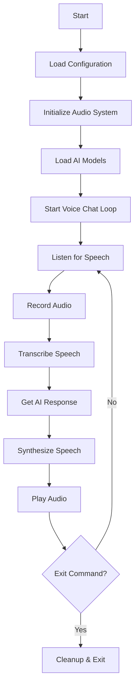

# Voice Chat with AI

A modern, real-time voice chat application that listens to your speech, transcribes it using FastWhisper, processes it with AI, and responds using XTTS text-to-speech synthesis.

## 🎯 Features

- **Real-time Voice Processing**: Continuous speech-to-text and text-to-speech loop
- **AI-Powered Conversations**: Intelligent responses using OpenRouter API
- **Voice Activity Detection**: Automatically starts/stops recording based on speech detection
- **Voice Cloning Support**: Optional voice cloning using XTTS
- **Environment-Based Configuration**: Secure configuration using .env files
- **Comprehensive Logging**: Detailed logging for debugging and monitoring
- **Audio Saving**: Save AI-generated audio responses
- **Clean Architecture**: Modular, maintainable codebase

## 🏗️ Architecture

The application follows a clean, modular architecture:

```
VoiceAIChat/
├── .env                          # Environment variables (create from .env.example)
├── .env.example                  # Template for environment setup
├── main.py                       # Simple entry point
├── requirements.txt              # Python dependencies
├── README.md                     # This file
├── src/
│   ├── config/                   # Configuration management
│   │   ├── __init__.py
│   │   └── settings.py           # Environment-based settings
│   ├── core/                     # Core application logic
│   │   ├── __init__.py
│   │   ├── voice_chat_app.py     # Main application
│   │   ├── speech_processor.py   # Speech processing
│   │   └── ai_chat.py           # AI communication
│   ├── audio/                    # Audio processing
│   │   ├── __init__.py
│   │   ├── recorder.py          # Audio recording
│   │   └── manager.py           # Audio device management
│   └── utils/                    # Utility functions (future)
├── temp/                         # Temporary files (auto-created)
├── ai-generated-audio/           # Saved AI audio (auto-created)
└── voice-samples/                # Voice cloning samples
```

## 📋 Prerequisites

- **Python**: 3.8 or higher
- **Operating System**: Windows, macOS, or Linux
- **Microphone**: Working microphone for voice input
- **Speakers/Headphones**: Audio output device
- **OpenRouter API Key**: For AI responses (get from [OpenRouter](https://openrouter.ai/))

## 🚀 Installation

### 1. Clone or Download the Project

```bash
git clone <repository-url>
cd VoiceAIChat
```

### 2. Create Virtual Environment (Recommended)

```bash
# Create virtual environment
python -m venv venv

# Activate virtual environment
# On Windows:
venv\Scripts\activate
# On macOS/Linux:
source venv/bin/activate
```

### 3. Install Dependencies

```bash
pip install -r requirements.txt
```

### 4. Configure Environment Variables

```bash
# Copy the example environment file
cp .env.example .env

# Edit .env file with your settings
# At minimum, set your OpenRouter API key:
OPENROUTER_API_KEY=your-actual-api-key-here
```

### 5. Optional: Voice Cloning Setup

If you want to use voice cloning:

1. Create a `voice-samples` directory
2. Place a 10-30 second clear audio sample as `sample.wav`
3. Update your `.env` file:
   ```
   VOICE_SAMPLE_PATH=voice-samples/sample.wav
   ```

## ⚙️ Configuration

All configuration is done through the `.env` file. Key settings include:

### API Configuration
```env
OPENROUTER_API_KEY=your-api-key-here
OPENROUTER_MODEL=openai/gpt-4
OPENROUTER_BASE_URL=https://openrouter.ai/api/v1
```

### Audio Settings
```env
SAMPLE_RATE=16000
SILENCE_THRESHOLD=20
SILENCE_DURATION=3.5
```

### Model Settings
```env
WHISPER_MODEL_SIZE=base
WHISPER_DEVICE=cuda
XTTS_LANGUAGE=es
```

### Application Settings
```env
VERBOSE_MODE=false
SAVE_AI_AUDIO=true
SHOW_TRANSCRIPTION=true
```

See `.env.example` for all available options with descriptions.

## 🎮 Usage

### Basic Usage

```bash
python main.py
```

### What Happens

1. **Initialization**: Models load (may take 30-60 seconds)
2. **Configuration Check**: Displays current settings
3. **Listening**: Application waits for speech input
4. **Recording**: Captures audio when speech is detected
5. **Processing**: Transcribes speech and generates AI response
6. **Playback**: Plays the synthesized speech back to you
7. **Loop**: Returns to listening state

### Exit Options

- **Keyboard**: Press `Ctrl+C`
- **Voice Commands**: Say "exit", "quit", "stop", "goodbye", or "bye"

## 🔧 Troubleshooting

### First Steps

1. **Check Dependencies**: The app will check and report missing dependencies
2. **Verify Configuration**: Ensure your `.env` file is properly configured
3. **Test Microphone**: Make sure your microphone is working and accessible

### Common Issues

**"No working input devices found"**
- Check microphone permissions in system settings
- Ensure microphone is not being used by another application
- Try running as administrator (Windows) or with sudo (Linux)

**"OpenRouter API key not configured"**
- Set `OPENROUTER_API_KEY` in your `.env` file
- Get an API key from [OpenRouter](https://openrouter.ai/)

**"Failed to load Whisper/TTS model"**
- Ensure you have sufficient disk space
- Check internet connection for model downloads
- Try using smaller models (e.g., `WHISPER_MODEL_SIZE=tiny`)

**Audio playback issues**
- Check speaker/headphone connections
- Verify pygame installation: `pip install pygame`
- Try different audio output devices

### Platform-Specific Issues

**Windows:**
- Enable microphone permissions in Privacy settings
- Update audio drivers
- Try running as administrator

**macOS:**
- Grant microphone access in System Preferences > Security & Privacy
- Check System Preferences > Sound > Input

**Linux:**
- Add user to audio group: `sudo usermod -a -G audio $USER`
- Install PulseAudio: `sudo apt install pulseaudio`
- Check ALSA devices: `arecord -l`

## 📊 System Requirements

### Minimum Requirements
- **RAM**: 4GB
- **Storage**: 3GB free space (for models)
- **CPU**: Multi-core processor
- **Audio**: Microphone and speakers/headphones

### Recommended Requirements
- **RAM**: 8GB+
- **GPU**: NVIDIA GPU with 4GB+ VRAM (for faster processing)
- **Storage**: 5GB+ free space
- **Audio**: Good quality microphone

## 🎛️ Advanced Usage

### Custom Models

You can customize the AI model in your `.env` file:
```env
OPENROUTER_MODEL=anthropic/claude-3-haiku
OPENROUTER_MODEL=meta-llama/llama-3.1-8b-instruct
```

### Different Languages

Change the synthesis language:
```env
XTTS_LANGUAGE=en  # English
XTTS_LANGUAGE=fr  # French
XTTS_LANGUAGE=de  # German
```

### Performance Tuning

For faster processing:
```env
WHISPER_MODEL_SIZE=tiny
WHISPER_DEVICE=cuda
```

For better quality:
```env
WHISPER_MODEL_SIZE=medium
SAMPLE_RATE=22050
```

### Verbose Mode

Enable detailed logging:
```env
VERBOSE_MODE=true
```

## 🔄 Application Flow



## 🤝 Contributing

1. Fork the repository
2. Create a feature branch: `git checkout -b feature-name`
3. Make your changes
4. Add tests if applicable
5. Commit your changes: `git commit -am 'Add feature'`
6. Push to the branch: `git push origin feature-name`
7. Submit a pull request

## 📄 License

This project is for educational and research purposes. Please ensure compliance with:
- OpenRouter API terms of service
- Audio processing laws in your jurisdiction
- Privacy regulations when recording audio

## 🙏 Acknowledgments

- **FastWhisper**: High-performance speech-to-text processing
- **XTTS**: Advanced text-to-speech synthesis
- **OpenRouter**: AI model API access
- **PyAudio**: Audio input/output handling
- **Pygame**: Audio playback functionality

## 📞 Support

If you encounter issues:

1. Check this README for troubleshooting steps
2. Review the application logs (`voice_chat.log`)
3. Ensure all dependencies are properly installed
4. Verify your `.env` configuration

---

**Note**: This application processes audio in real-time and requires proper microphone and speaker setup for optimal performance. The first run may take longer as models are downloaded and cached.
